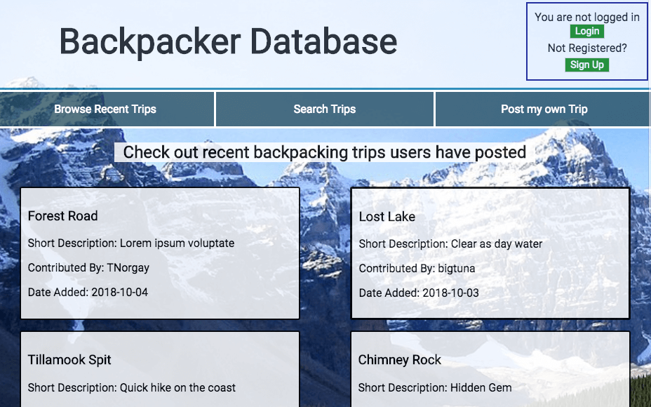
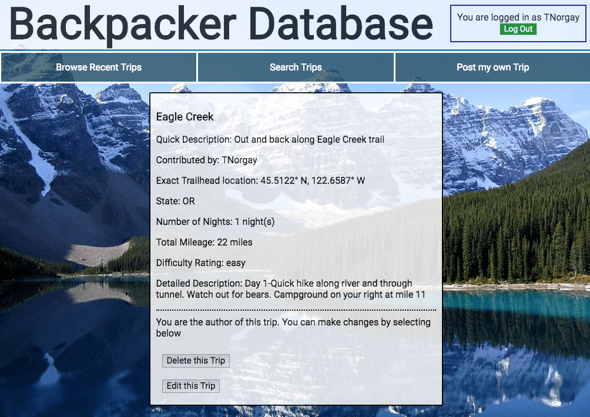
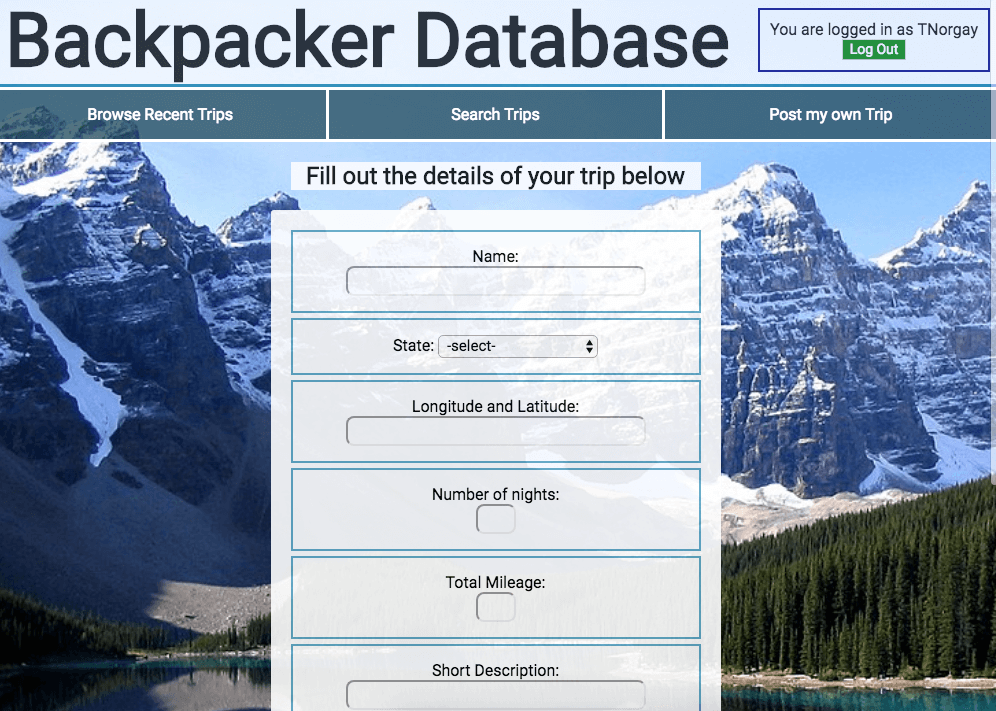
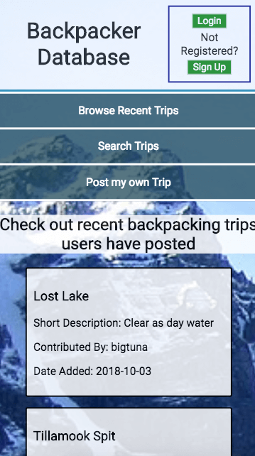

# Backpacker Database

## Overview
An app where users can contribute, view, and search for backcountry backpacking trips throughout the US.

## Screenshots
Landing View

Trip Details

Searching Trips

Posting Trips

Mobile Landing View

## Live Demo
[Link to Demo](https://thawing-beach-93547.herokuapp.com)

## API Documentation
API Layer of Backpacker Database allows for:

- POST /trip...Add a new trip
- GET /trip...Find trips by most recent or by severeal search parameter options
- GET /trip/{tripId}...Find trip by ID
- PUT /trip...Updtate an existing trip that you have contributed
- DELETE /trip...Delete an existing trip that you have contributed

- POST  /user...Register as a new user
- GET /user/{userID}...Find user by ID
- POST  /auth/login...Login as an existing user

## Tecnhnology used

### Front End
- HTML
- CSS
- JavaScript
- JQuery

### Back End

- Node.js
- Express Framework
- Passport Authentification
- Jwt Security

### Testing

- Chai
- Chai-http
- Mocha
